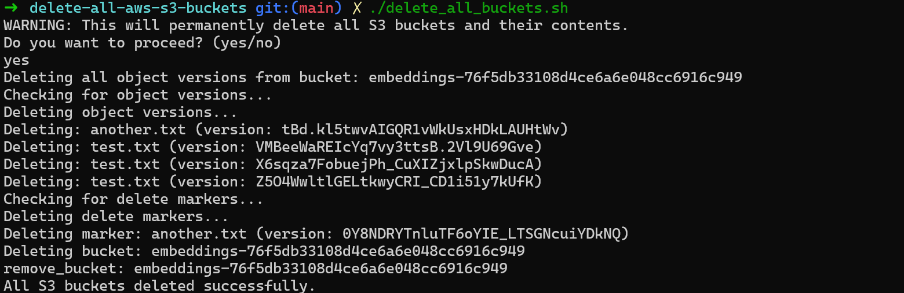

# Delete All AWS S3 Buckets


A bash script to safely delete all S3 buckets and their contents from your AWS account, including versioned objects and delete markers.

## ⚠️ WARNING

This script will **permanently delete** all S3 buckets and their contents from your AWS account. This action is:

- Irreversible
- Affects all buckets in your account
- Deletes all object versions and delete markers

## Prerequisites

- AWS CLI installed and configured with appropriate credentials
- Bash shell environment
- Sufficient AWS permissions to list and delete S3 buckets and objects

## Installation

1. Clone this repository:

    ```bash
    git clone https://github.com/benito-martin/delete-all-aws-s3-buckets.git
    cd delete-all-aws-s3-buckets
    ```

2. Make the script executable:

    ```bash
    chmod +x delete_all_buckets.sh
    ```

## Usage

Run the script:

```bash
./delete_all_buckets.sh
```

The script will:

1. List all S3 buckets in your account
2. Ask for confirmation before proceeding
3. For each bucket:
   - Delete all object versions
   - Remove all delete markers
   - Delete the bucket itself
4. Provide progress feedback throughout the process

    

## Safety Features

- Confirmation prompt before deletion
- Verification of object and version existence
- Error handling for failed operations
- Progress feedback for each step

## License

MIT License - See [LICENSE](LICENSE) file for details.

## Author

Benito Martin

## Contributing

Contributions are welcome! Please feel free to submit a Pull Request.
